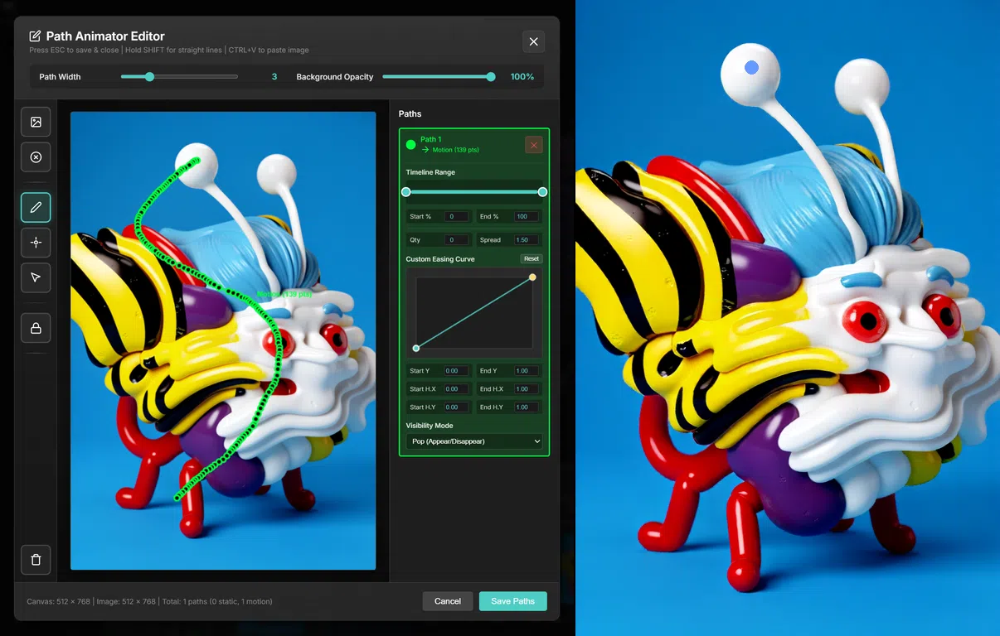
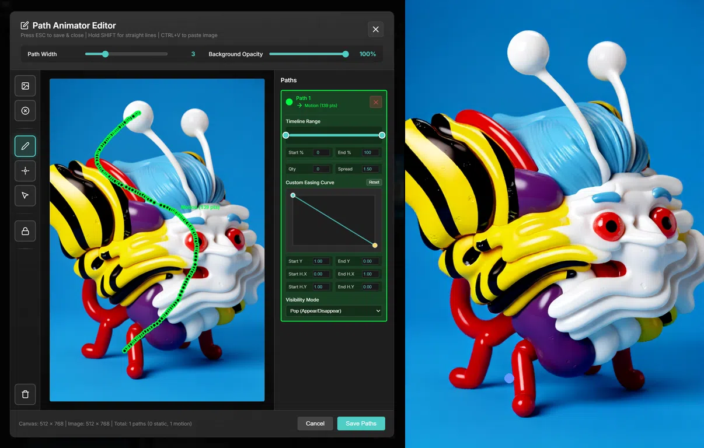
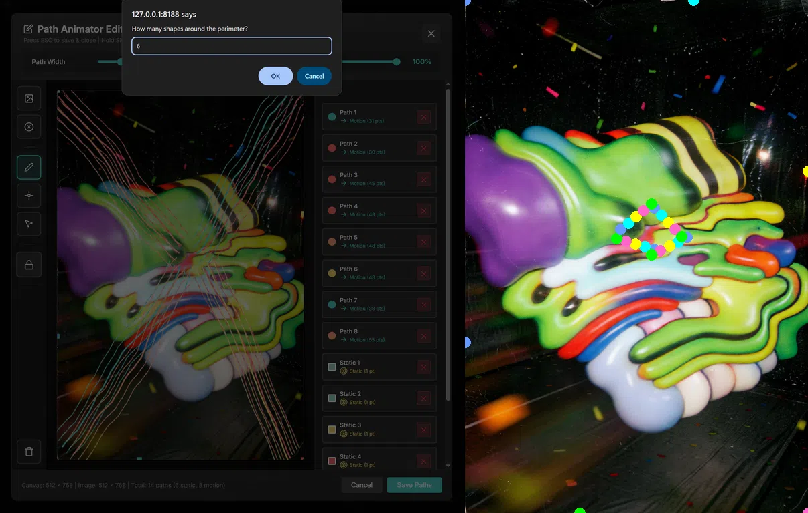

# WanMove Path Animator
A ComfyUI custom node for creating motion tracks to be used with [Wan-Move](https://github.com/ali-vilab/Wan-Move).

## 1) Features
- **Interactive Path Editor** - Visual modal interface for drawing motion paths and static anchor points
- **Two Path Types**:
  - **Motion Paths** - Draw continuous paths for shapes to follow over time
  - **Static Anchors** - Single-point paths for stationary shapes
- **Background Image Support** - Input, load, or paste reference images to draw paths on
- **Timeline Start & End** - Set when the animation begins and finishes
- **Animation Curves** - Control the speed and direction of the animation
- **Path Spread** - Duplicate paths to widen their effects
- **Visibility** - Modes for 

## 2) Installation
1. Clone or download this repository into your ComfyUI custom_nodes folder:
<code>
cd ComfyUI/custom_nodes/
git clone https://github.com/brbbbq/ComfyUI-WanMove-Path-Animator
</code>

2. Restart ComfyUI

## 3) Usage
### Basic Workflow
1. Add the **"WanMove Path Animator"** node to your workflow
2. Connect image to image input to appear in background.
3. Click the **"Edit Paths"** button to open the path editor
4. Optionally load a background image with **🖼️** or paste with **Ctrl+V** (only if there's no image input)
5. Use the toolbar to:
   - **✏️ Pencil** - Draw motion paths (hold SHIFT for straight lines)
   - **📍 Point** - Add static anchor points
   - **🔒 Lock Perimeter** - Auto-generate static points around border
6. Use sidebar to:
   - **🕗 Timeline Range** - Control the Start and End point of the animation
   - **🧈 Spread** - Create parallel paths
   - **📈 Custom Easing Curve** - Control the dynamic speed of the animation
   - **👁️ Visibility Mode** - Set track visibilty properties
8. Press **ESC**, or click **Save Paths** to save and close
9. Connect outputs to your workflow

### Node Parameters
- `frame_width` & `frame_height` - Frame dimensions that the output coordinates will be resized to
- `frame_count` - Number of frames that the motion path will be resampled to

### Outputs
1. **TRACKS** - Motion paths formated for native [**"WanMoveTrackToVideo"**](https://docs.comfy.org/built-in-nodes/WanMoveTrackToVideo) nodes - includes visability info
2. **COORDINATES** - Raw coordinate data for use with [**"comfyui_cotraker_node"**](https://github.com/s9roll7/comfyui_cotracker_node) pack - no visibility info
   - **PerlinCoordinateRandomizerNode**
   - **XYMotionAmplifierNode**
4. **DEBUG** - Raw path data from the Path Animator Editor (JavaScript) before being resampled by the node (Python)

## 4) Path Animation Editor
### Keyboard Shortcuts:
- **ESC** - Save paths and close editor
- **SHIFT (hold)** - Draw straight lines (can be pressed intermittently)
- **Ctrl+V** - Paste background image from clipboard

### Toolbar:
#### ✏️ Pencil Tool
Draw motion paths by clicking and dragging.
- Hold **SHIFT** to constrain to straight lines, can be pressed intermittently so you can go from hand drawn to straight lines along a single path.

#### 📍 Point Tool
Click once to create a single anchor point. 
- Useful when you don't want an element to move in the video.
- Compatible with Spread and Visibiliity options

#### ↖️ Select Tool
Directly select paths in the canvas to open their parameters in the sidebar.

#### 🔒 Lock Perimeter
Automatically distributes N static anchor points evenly around the canvas border. Useful for fixing frame edges in place.

#### 🗑️ Clear All
Deletes all Paths and Static tracks.

### Sidebar:
#### 🕗 Timeline Range
Sets the Start and End points of the animation as a percentage of the `frame_count`. Use the visual slider or set exact values in the numerical fields.

#### 🧈 Spread
Creates duplicate tracks parallel to the movement of the path. 
- Quantities are in units of 2, as pairs are added outward from the center
- The spread value is the distance between paths scaled proportional to `frame_width` x `frame_height`

#### 📈 Custom Easing Curve
Basic animation curve to control the rate and direction of movement.
- Y-Dimension (vertical, position), defines the position of the point along the Path
- X-Dimension (horizontal, time), defines when along the Timeline should the point be at the position along the path, as a proportion of `frame_count`
- `Start Y` & `End Y` - Define where along the path you want the animation to Start/End
- `Start H.X` & `Start H.Y` - Set the X/Y coordinates for the Bezier Handles that define the curve from the Start point
- `End H.X` & `End H.Y` - Set the X/Y coordinates for the Bezier Handles that define the curve from the End point

## 5) Examples

.webp)
.webp)
.webp)
.webp)

## Technical Details

## Requirements

- Python 3.8+
- PIL (Pillow)
- NumPy
- PyTorch
- ComfyUI

## License

MIT License - See LICENSE file for details

## Credits

Based on FL Path Animator by Machine Delusions for the Fill-Nodes pack.
