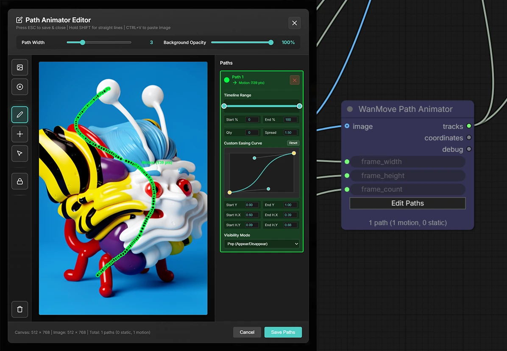
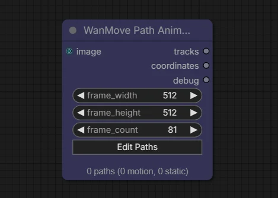
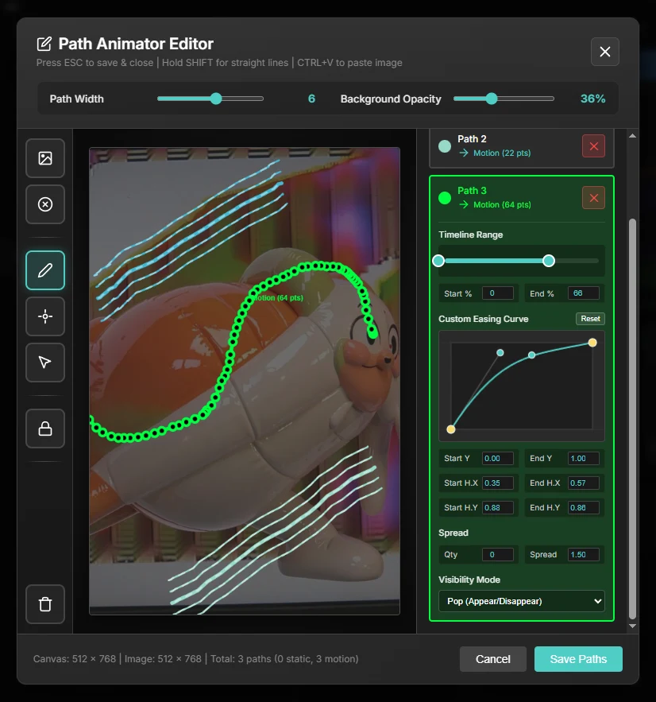
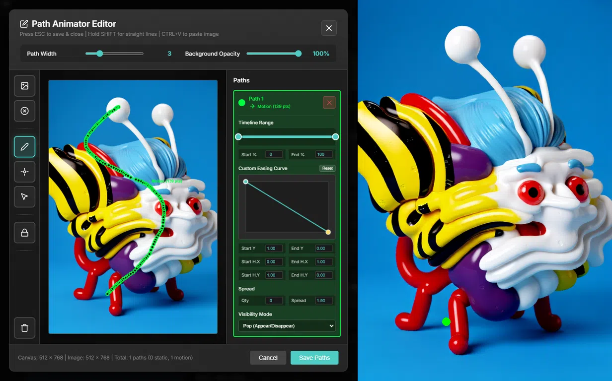
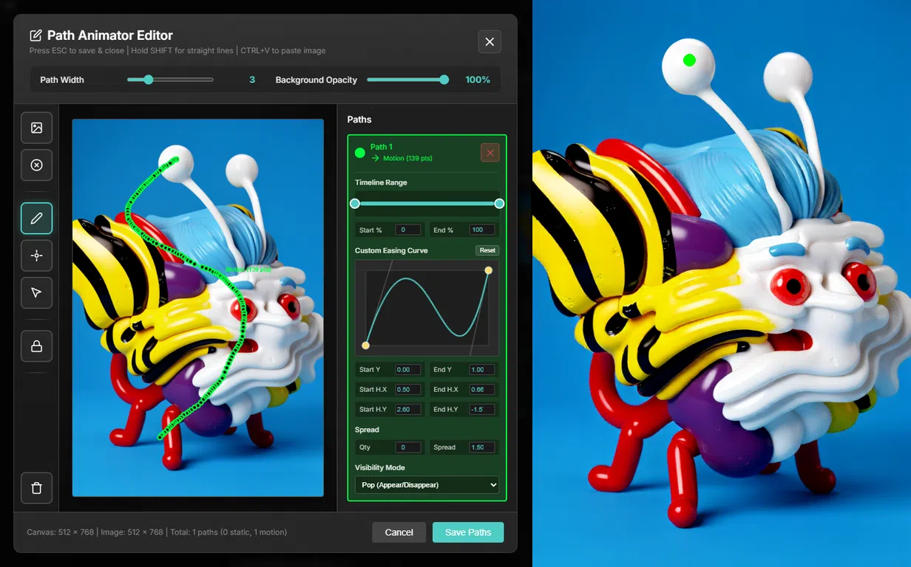
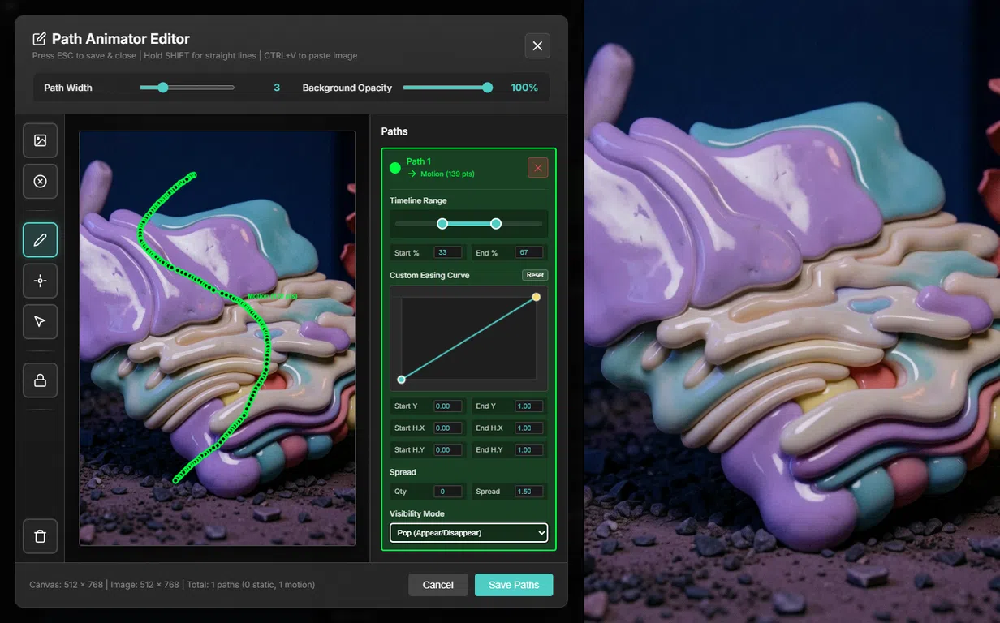
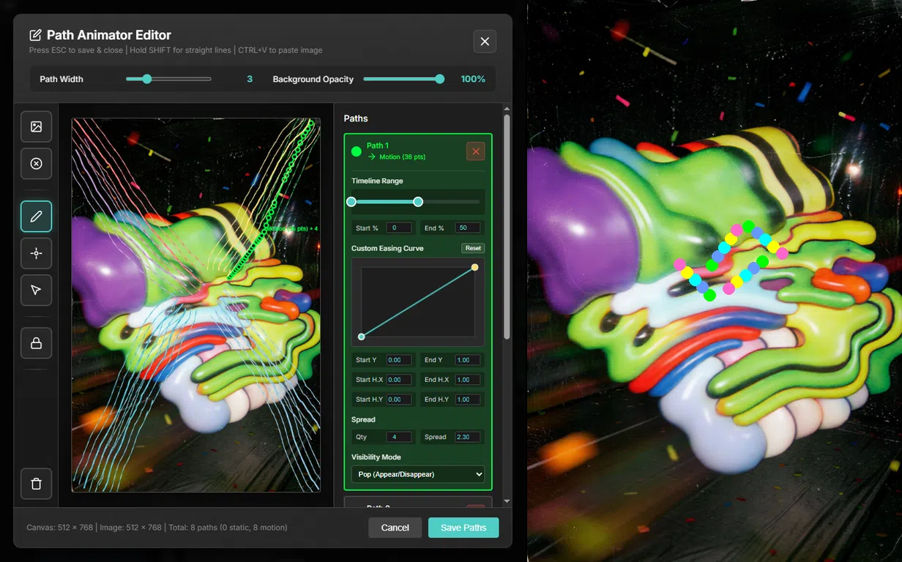
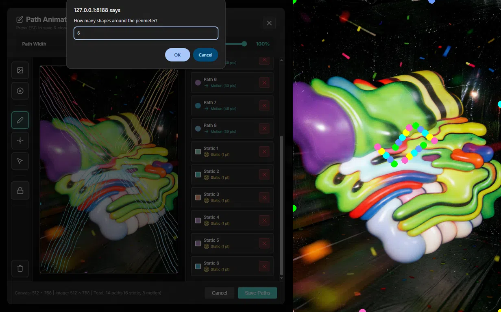

<a id="top"></a>
# WanMove Path Animator
A ComfyUI custom node for creating motion tracks to be used with [Wan-Move](https://github.com/ali-vilab/Wan-Move).

- **[FEATURES](#features)**
- **[INSTALLATION](#installation)**
- **[USAGE](#usage)**
    - [Basic Workflow](#basic-workflow)
    - [Node Parameters](#node-parameters)
    - [Outputs](#outputs)
- **[PATH ANIMATOR EDITOR](#path-animator-editor)**
    - [Keyboard Shortcuts](#keyboard-shortcuts)
    - [Toolbar](#toolbar)
    - [Sidebar](#sidebar)
- **[EXAMPLES](#examples)**
- **[ACKNOWLEDGEMENTS](#acknowledgements)**



<details open>
<summary><h2>FEATURES</h2></summary>

- **Interactive Path Editor** - Visual interface for drawing motion paths and static anchor points
- **Path Types**:
    - **Motion Paths** - Draw continuous paths for animation to follow
    - **Static Anchors** - Lock stationary elements in place
- **Background Image Support** - Input, load, or paste reference images in the background
- **Timeline Start & End** - Set when the animation begins and ends
- **Animation Curves** - Control the speed and direction of the animation
- **Path Spread** - Duplicate paths to widen their effects
- **Visibility** - Control when the paths appear in the timeline

[↑ Back to Top](#top)
</details>


<details open>
<summary><h2>INSTALLATION</h2></summary>

1. Clone or download this repository into your ComfyUI custom_nodes folder:
```cli
cd ComfyUI/custom_nodes/
git clone https://github.com/brbbbq/ComfyUI-WanMove-Path-Animator
```
2. Restart ComfyUI

[↑ Back to Top](#top)
</details>


<details open>
<summary><h2>USAGE</h2></summary>

**📢 Example workflow can be found in the [workflows folder](/workflows)**
<details open>
<summary><h3>Basic Workflow:</h3></summary>

1. Add the **"WanMove Path Animator"** node to your workflow
2. Connect image to image input to appear in background.
3. Click the **"Edit Paths"** button to open the path editor
4. Optionally load a background image with **🖼️** or paste with **Ctrl+V** (only if there's no image input)
5. Use the [Toolbar](https://github.com/brbbbq/ComfyUI-WanMove-Path-Animator#toolbar) to:
    - **✏️ Pencil** - Draw motion paths (hold SHIFT for straight lines)
    - **📍 Point** - Add static anchor points
    - **🔒 Lock Perimeter** - Auto-generate static points around border
6. Use [Sidebar](https://github.com/brbbbq/ComfyUI-WanMove-Path-Animator#sidebar) to:
    - **🕗 Timeline Range** - Control the Start and End point of the animation
    - **📈 Custom Easing Curve** - Control the dynamic speed of the animation
    - **🧈 Spread** - Create parallel paths
    - **👁️ Visibility Mode** - Set track visibilty properties
8. Press **ESC**, or click **Save Paths** to save and close
9. Connect outputs to your workflow
</details>
<br>


<details open>
<summary><h3>Node Parameters:</h3></summary>

- `frame_width` & `frame_height` - Frame dimensions that the output coordinates will be resized to (project dimensions)
- `frame_count` - Number of frames that the motion path will be resampled to (should be equal to the project length)
</details>


<details open>
<summary><h3>Outputs:</h3></summary>

- **TRACKS** - Motion paths formated for ComfyUI native Wan-Move nodes (includes visibility info)
    - [**"WanMoveTrackToVideo"**](https://docs.comfy.org/built-in-nodes/WanMoveTrackToVideo)
    - [**"WanMoveVisualizeTracks"**](https://docs.comfy.org/built-in-nodes/WanMoveVisualizeTracks)
    - [**"WanMoveConcatTrack"**](https://docs.comfy.org/built-in-nodes/WanMoveConcatTrack)
- **COORDINATES** - Raw coordinate data for use with [**comfyui_cotracker_node**](https://github.com/s9roll7/comfyui_cotracker_node) pack (no visibility info)
    - **"PerlinCoordinateRandomizerNode"**
    - **"XYMotionAmplifierNode"**
    - [**"WanMoveTracksFromCoords"**](https://docs.comfy.org/built-in-nodes/WanMoveTracksFromCoords) (ComfyUI native node for converting coordinates to tracks)
- **DEBUG** - Raw path data from the Path Animator Editor (JavaScript) before being resampled by the node (Python)  
</details>


[↑ Back to Top](#top)
</details>


<details open>
<summary><h2>PATH ANIMATOR EDITOR</h2></summary>



<details open>
<summary><h3>Keyboard Shortcuts:</h3></summary>

- **ESC** - Save paths and close editor
- **SHIFT (hold)** - Draw straight lines (can be pressed intermittently)
- **Ctrl+V** - Paste background image from clipboard
</details>


<details open>
<summary><h3>Toolbar:</h3></summary>

**✏️ Pencil Tool** - Draw motion paths by clicking and dragging
- Hold **SHIFT** to constrain to straight lines
- Can be pressed intermittently so you can go from hand drawn to straight lines along a single path.

**📍 Point Tool** - Create a single anchor point 
- Useful when you don't want an element to move in the video
- You can also use the **Pencil Tool** to create static points by clicking on the canvas once
- Compatible with Spread and Visibiliity options

**↖️ Select Tool** - Directly select paths in the canvas to open their parameters in the sidebar

**🔒 Lock Perimeter** - Evenly distributes static anchor points around the edge of the canvas
- Useful for generating a static camera shot by fixing the edges of the frames in place

**🗑️ Clear All** - Deletes all tracks
</details>


<details open>
<summary><h3>Sidebar:</h3></summary>

**🕗 Timeline Range** - Sets the **Start** & **End** points of the animation
- Calculated as a percentage of the `frame_count`
- Use the visual slider or set exact values in the numerical fields

**📈 Custom Easing Curve** - Basic animation curve to control the rate and direction of the movement
- Y-Axis (vertical) **Position** - Defines the **Position** of the point along the path
- X-Axis (horizontal) **Timeline** - Corresponds with when along the **Timeline** the point should be at what **Position** along the path
- `Start Y` & `End Y` - Defines the **Position** along the **Path** you want the animation to **Start** & **End**
- `Start H.X` & `Start H.Y` - Sets the coordinates for the Bezier **Handles** that define the curve from the **Start** point
- `End H.X` & `End H.Y` - Sets the coordinates for the Bezier **Handles** that define the curve from the **End** point

**🧈 Spread** - Creates duplicate parallel tracks
- Quantities are in units of 2 as pairs are added outward from the center
- The spread distance is scaled proportional to the size of the canvas

**👁️ Visibility Mode** - Sets whether path visbility is defined by timeline or always persistent
- **Pop Mode** - Path/Point will only be visible for the duration of the **Timeline**
- **Static Mode** - Path/Point will remain visible through the whole video
- Useful for creating continuous movement over the same area of the frame, or stringing together complex movements
</details>


[↑ Back to Top](#top)
</details>


<details open>
<summary><h2>EXAMPLES</h2></summary>

<details open>
<summary><b>Linear</b></summary>

Default linear animation

</details>


<details open>
<summary><b>Reverse</b></summary>

Reverse animation by setting `Start Y` & `Start H.Y` to 1.00, and `End Y` & `End H.Y` to 0.00

</details>


<details open>
<summary><b>Ease In</b></summary>

Slow animation that ramps up to fast

</details>


<details open>
<summary><b>Ease Out</b></summary>

Fast animation that decelerates to slow

</details>


<details open>
<summary><b>Ease In-Out</b></summary>

Slow - Fast - Slow

</details>


<details open>
<summary><b>Ease Out-In</b></summary>

Fast - Slow - Fast

</details>


<details open>
<summary><b>Ping-Pong</b></summary>

Forward - Reverse - Forward (TIP: Handles for the curve can be adjusted outside the window by manually setting the value fields)

</details>


<details open>
<summary><b>Spread</b></summary>

Spread widens the effect of the path by creating duplicates (`Qty` 6, `Spread` 6.40)

</details>


<details open>
<summary><b>Visibility Mode Pop</b></summary>

Visibility mode only comes into effect if `Timeline Range` is set (`Start%` 33, `End %` 67). If there's a gap in the begining of the Timeline, Wan-Move will lead into the animation. If theres a gap at the end, it will follow through.

</details>


<details open>
<summary><b>Visibility Mode Static</b></summary>

Setting visibility to "Static" the point remains at the beginning and end of the animation

</details>


<details open>
<summary><b>Continuous Zoom</b></summary>

By making 2 sets of paths radiating outwards, one set **ending** at 50% and the other **starting** at 50% for the `Timeline Range`, you can create a zoom effect

</details>


<details open>
<summary><b>Perimeter Lock</b></summary>

By locking the perimeter with points, it pins the frame creating a static camera shot



</details>

[↑ Back to Top](#top)
</details>


<details open>
<summary><h2>ACKNOWLEDGEMENTS</h2></summary>

- Node based off Machine Delusion's original: [ComfyUI_FL-Path-Animator](https://github.com/filliptm/ComfyUI_FL-Path-Animator)
- Wan-Move project: [Wan-Move](https://github.com/ali-vilab/Wan-Move)
- Kijai scaled model: [WanMove](https://huggingface.co/Kijai/WanVideo_comfy_fp8_scaled/tree/main/WanMove)
- Coding assistance using Gemini 3.1 Pro Preview
- Special thanks to the [Banadoco](https://www.banodoco.ai/) community on Discord
</details>
